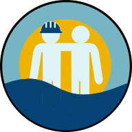

# Agenda Marítima (Marine Scheduler)
Agenda Marítima, ou Marine Scheduler, é um portal que permite a marítimos e trabalhadores offshore adicionar seus amigos da área e checar se estarão disponíveis numa determinada data.

## Motivação
A inspiração para este projeto vem da frustração de nunca saber quando seus amigos marítimos estarão disponíveis para eventos, tendo que constantemente enviar mensagens para conseguir tal informação. Com o site, enviar estas mensagens não é mais necessário: o marítimo irá preencher a sua escala no app e seus amigos terão acesso a esses turnos.

## Uso
A página está disponível em https://agendamaritima.herokuapp.com

Uso da API REST está documentado em https://agendamaritima.herokuapp.com/swagger-ui.html

## Features
- [x] Verificação de usuários disponíveis
- [x] Requisição, aceitação e exclusão de amizades
- [x] Calendário de escalas
- [ ] Eventos
- [ ] Notificações Push
- [ ] Responsividade

## Tech Stack
- [React](https://reactjs.org/)
- [Material-UI](https://material-ui.com/)
- [Spring Boot](https://spring.io/projects/spring-boot)
- [Formik + Yup](https://formik.org/)
- [PostgreSQL](https://www.postgresql.org/)

## Licença
[GPL-3.0](https://choosealicense.com/licenses/gpl-3.0)
