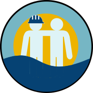

# Marine Scheduler (Agenda Marítima)

Marine Scheduler is website that allows mariners and offshore workers to add their friends on the field and check if they will be available at a specific date.

## Motivation
The inspiration for this project comes from the frustration of never knowing when your seafarer friends will be available for events, having to constantly message them to get this information. With the website, messaging is no longer necessary: the seafarer will fill his or her shift on the app and his friends will have access to those shifts.

## Usage
Website is available at https://seamates.herokuapp.com

API usage is documented with Swagger at https://seamates.herokuapp.com/swagger-ui.html

## Features
- [x] Checking available users
- [x] Requesting, accepting and deleting friendships
- [x] Shift calendar
- [x] Facebook login (OAuth2)
- [ ] Events
- [ ] Discussion forums 

## Tech Stack
- [React](https://reactjs.org/)
- [Material-UI](https://material-ui.com/)
- [Spring Boot](https://spring.io/projects/spring-boot)
- [Spring Security](https://spring.io/projects/spring-security)
- [Formik + Yup](https://formik.org/)
- [PostgreSQL](https://www.postgresql.org/)

## License
[GPL-3.0](COPYING)
